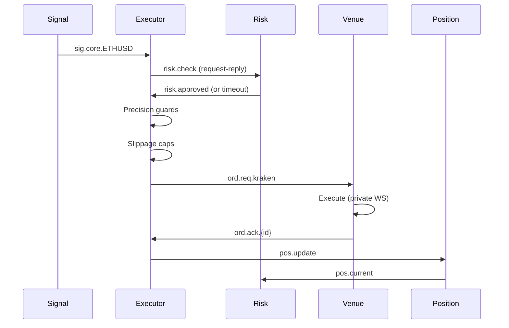
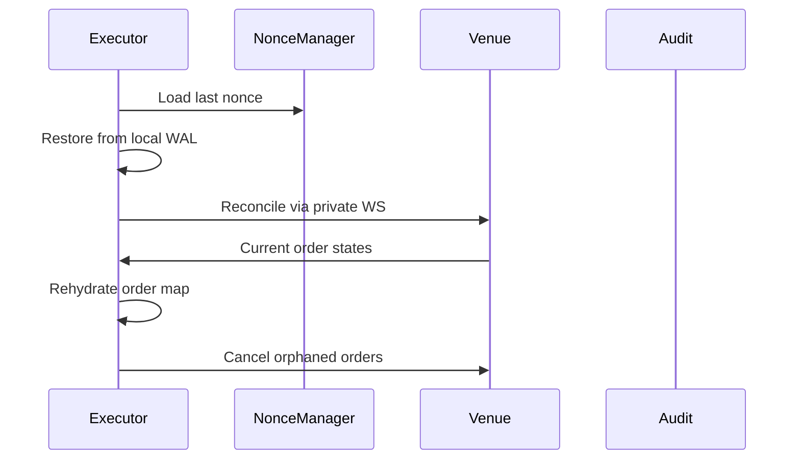

# Complete Trading System Architecture

## Overview

This document defines the complete set of components required for a robust, production-grade algorithmic trading system. Building on the core services (Ingestion, Analytics, Execution, NATS), it adds essential cross-cutting services for risk management, position tracking, and operational safety.

## System Components Map

```
┌─────────────────────────────────────────────────────────────────────────┐
│                              TRADING SYSTEM                             │
├─────────────────────────────────────────────────────────────────────────┤
│                                                                         │
│     ┌─────────────────┐  ┌─────────────────┐  ┌─────────────────┐       │
│     │ Exchange Adapter│  │ Exchange Adapter│  │ Exchange Adapter│       │
│     │   (Kraken)      │  │   (Binance)     │  │     (OKX)       │       │
│     └────────┬────────┘  └────────┬────────┘  └────────┬────────┘       │
│              │                    │                    │                │
│              └────────────────────┴────────────────────┘                │
│                                   │                                     │
│     ┌─────────────────────────────▼─────────────────────────────────┐   │
│     │                         NATS MESSAGE BUS                      │   │
│     │  Core Topics: md.*, sig.{strategy}.*, ord.*, risk.*, pos.*   │    │
│     │  JetStream: audit.* only (no hot-path)                       │    │
│     └───────┬───────────┬───────────┬───────────┬─────────────────┘     │
│             │           │           │           │                       │
│     ┌───────▼───────┐ ┌─▼───────────▼─┐ ┌─────▼─────────┐               │
│     │   Ingestion   │ │   Analytics    │ │   Execution   │              │
│     │   Service     │ │   Engine       │ │   Engine      │              │
│     │   (Rust)      │ │   (Julia)      │ │   (Rust)      │              │
│     └───────┬───────┘ └───────┬───────┘ └───────┬───────┘               │
│             │                 │                 │                       │
│     ┌───────▼─────────────────▼─────────────────▼───────┐               │
│     │              CORE SUPPORT SERVICES                 │              │
│     ├───────────────────────────────────────────────────┤               │
│     │                                                    │              │
│     │  ┌──────────────┐  ┌──────────────┐  ┌──────────────┐             │
│     │  │Risk Gateway  │  │Position/PnL  │  │Reference Data│             │
│     │  └──────────────┘  └──────────────┘  └──────────────┘             │
│     │                                                    │              │
│     │  ┌──────────────┐  ┌──────────────┐  ┌──────────────┐             │
│     │  │Config Service│  │Venue Registry│  │Audit Service │             │
│     │  └──────────────┘  └──────────────┘  └──────────────┘             │
│     │                                                    │              │
│     │  ┌──────────────┐  ┌──────────────┐  ┌──────────────┐             │
│     │  │Circuit Break │  │Clock Service │  │Health/Admin  │             │
│     │  └──────────────┘  └──────────────┘  └──────────────┘             │
│     └────────────────────────────────────────────────────┘              │
│                                                                         │
│  ┌────────────────────────────────────────────────────┐                 │
│  │                  PERSISTENCE LAYER                 │                 │
│  │  ┌────────────┐  ┌────────────┐  ┌──────────────┐  │                 │
│  │  │ClickHouse  │  │PostgreSQL  │  │  JetStream   │  │                 │
│  │  │  (Ticks)   │  │(Ref Data)  │  │   (Audit)    │  │                 │
│  │  └────────────┘  └────────────┘  └──────────────┘  │                 │
│  └────────────────────────────────────────────────────┘                 │
└─────────────────────────────────────────────────────────────────────┘
```

## Shared Memory Fast Path (Intra-Node)

### Overview
For maximum performance within a single node, market data and signals use lock-free shared memory rings instead of NATS serialization overhead. NATS remains for inter-node distribution and control plane.

### Architecture
```yaml
shared_memory:
  rings:
    per_symbol:
      type: MPSC  # Multi-producer, single-consumer
      size: 65536  # Power of 2 for fast modulo
      layout: SoA  # Structure of Arrays for cache efficiency
      
  cacheline_alignment: 64  # Prevent false sharing
  
  flow:
    - Ingestion writes to symbol-sharded rings
    - Analytics reads from rings (zero-copy)
    - Signals written to executor rings
    - NATS publisher subscribes for inter-node fanout
    
  memory_layout:
    # Each ring entry (aligned to 64 bytes)
    struct TickEntry {
      ts_ns: i64,        // 8 bytes
      venue_id: u16,     // 2 bytes  
      symbol_id: u16,    // 2 bytes
      bid: f64,          // 8 bytes
      ask: f64,          // 8 bytes
      bid_size: f64,     // 8 bytes
      ask_size: f64,     // 8 bytes
      sequence: u64,     // 8 bytes
      flags: u32,        // 4 bytes (quality flags)
      padding: [u8; 12]  // 12 bytes padding to 64
    }
```

### Benefits
- Eliminates serialization/deserialization overhead
- No syscalls for intra-node communication
- Predictable latency (no network jitter)
- Zero garbage collection pressure in Julia

## Core Services (Exchange-Agnostic)

### 1. Ingestion Service (Rust)
**Purpose**: Normalize and distribute market data

**Responsibilities**:
- Subscribe to adapter-published ticks
- Sequence validation and gap detection
- Data quality checks (crossed book, staleness, gaps)
- Async persistence to ClickHouse
- Per-symbol actor model with bounded mailboxes
- Heartbeat monitoring

**Actor Model**:
```rust
// Per-symbol actor with single-threaded event loop
struct SymbolActor {
    symbol: String,
    ring: Arc<MpscRing<TickEntry>>,
    quality_checker: DataQualityChecker,
    gap_detector: GapDetector,
    clickhouse_batch: Vec<Tick>,
}

// Sharding by consistent hash
fn shard_for_symbol(symbol: &str) -> usize {
    xxhash64(symbol) % NUM_INGESTION_ACTORS
}
```

**Data Quality Fast Path**:
- Crossed book detection: drop if bid > ask * (1 + tolerance)
- Staleness check: drop if recv_ts - exch_ts > max_age_ms
- Sequence gaps: quarantine and request snapshot
- Publish quality flags with ticks for downstream adaptation

**Publishes**:
- Shared memory ring: Per-symbol normalized ticks (intra-node)
- `md.norm.{venue}.{symbol_canon}` - Per-venue normalized data (NATS)
- `md.agg.{symbol_canon}` - Cross-venue aggregated data (NATS)
- `md.health.{venue}` - Connection health

**Subscribes**:
- `md.{venue}.{symbol}.*` - Raw venue ticks

### 2. Analytics Engine (Julia)
**Purpose**: Generate trading signals from market data

**Responsibilities**:
- Feature computation (VPIN, microstructure, OU)
- Signal generation with confidence scoring
- Position sizing (Kelly criterion)
- Risk-adjusted signal filtering
- Deterministic computation (single-threaded BLAS)
- Zero-allocation hot path with pre-allocated buffers

**Embedded Mode Option**:
```rust
// Rust analytics service with embedded Julia
struct AnalyticsService {
    julia_ctx: *mut jl_context,
    symbol_actors: HashMap<String, AnalyticsActor>,
}

// Direct shared memory access, no serialization
impl AnalyticsActor {
    fn process_tick(&mut self, tick: &TickEntry) {
        // Call Julia function with pointer to tick
        unsafe {
            jl_call2(self.compute_fn, 
                     tick as *const _ as *mut jl_value_t,
                     self.state);
        }
    }
}
```

**Julia Optimizations**:
```julia
# Precompiled sysimage with all paths
using PackageCompiler
create_sysimage([:LinearAlgebra, :Statistics], 
                precompile_execution_file="precompile.jl")

# Performance-critical setup
using LinearAlgebra
BLAS.set_num_threads(1)  # Deterministic
Random.seed!(config.seed)

# GC tuning for low latency
GC.enable(true)
ENV["JULIA_GC_ALLOC_POOL"] = "20000000"  # 20MB pools
ENV["JULIA_GC_ALLOC_OTHER"] = "10000000" # 10MB other

# Pre-allocated buffers per actor
mutable struct ActorState
    window::CircularBuffer{Float64}
    features::Vector{Float64}
    scratch::Vector{Float64}
end

# Zero-allocation compute with @views
function compute_signal(tick::Ptr{TickEntry}, state::ActorState)
    @inbounds @fastmath begin
        # Use views, no allocations
        update_features!(@view(state.features), tick, state.scratch)
        confidence = compute_confidence(state.features)
        # Write directly to signal ring
    end
end
```

**Publishes**:
- Shared memory ring: Trading signals (intra-node)
- `sig.{strategy_id}.{symbol}` - Trading signals with constraints (NATS)

**Subscribes**:
- Shared memory ring: Market data ticks (intra-node)
- `md.norm.{venue}.{symbol_canon}` - Per-venue market data (NATS fallback)
- `md.agg.{symbol_canon}` - Aggregated market data (optional)
- `pos.current` - Current positions for context
- `config.analytics.{strategy_id}` - Strategy parameters

### 3. Execution Engine (Rust)
**Purpose**: Convert signals to orders with smart routing

**Responsibilities**:
- Signal validation (TTL, confidence)
- Smart order routing with slippage caps
- Fill tracking via private WebSocket only (no REST polling)
- Precision guards (tick/lot/step validation)
- Restart recovery (rehydrate outstanding orders)
- Shadow trading mode for accuracy validation
- Local risk guard for hot-path checks

**Local Risk Guard**:
```rust
// In-process risk mirror, refreshed via NATS
struct LocalRiskGuard {
    position_limits: Arc<RwLock<HashMap<String, PositionLimit>>>,
    drawdown_tracker: DrawdownTracker,
    last_refresh: AtomicU64,
}

impl LocalRiskGuard {
    // Fast path - no network hop
    fn check_order(&self, order: &Order) -> RiskDecision {
        let limits = self.position_limits.read();
        
        // Optimistic local check
        if self.within_cached_limits(order, &limits) {
            return RiskDecision::Approved;
        }
        
        // Fallback to central risk gateway
        RiskDecision::RequiresGatewayCheck
    }
}
```

**Execution Micro-Optimizations**:
```rust
// Pre-built templates and contexts
struct ExecutorOptimizations {
    hmac_contexts: HashMap<String, HmacContext>,
    header_templates: HashMap<String, Vec<u8>>,
    venue_precision_cache: VenuePrecisionCache,
    tls_sessions: TlsSessionCache,
}

// L1-fit precision cache
#[repr(C, align(64))]
struct VenuePrecisionCache {
    entries: [PrecisionEntry; 256],  // Fixed size, indexed by symbol_id
}

// Connection optimizations
fn setup_connection(socket: &TcpStream) {
    socket.set_nodelay(true)?;         // TCP_NODELAY
    socket.set_keepalive(Some(Duration::from_secs(30)))?;
    // SO_REUSEPORT for per-core listeners
}
```

**Requirements**:
- Private WebSocket mandatory for production venues (shadow-only without)
- Idempotent client IDs generated by executor's NonceManager
- Monotonic nonce management per venue (executor-owned)
- Slippage enforcement from signal constraints
- Local WAL for restart recovery (not audit)
- Concurrency caps per venue/symbol enforced here
- Reject orders to shadow_only venues with VENUE_POLICY error
- Pre-compute HMAC signatures and reuse TLS sessions

**Publishes**:
- `ord.req.{venue}` - Order requests (request-reply with 20ms timeout, WAL-backed)
- `risk.check` - Risk validation (only for boundary cases)
- `ord.cancel.req` - Cancel requests
- `ord.replace.req` - Modify requests

**Subscribes**:
- Shared memory ring: Trading signals (intra-node)
- `sig.{strategy_id}.{symbol}` - Trading signals (NATS fallback)
- `ord.ack.{venue}` - Order acknowledgments (with client_id header)
- `risk.limits` - Risk limit updates (refreshes local cache)
- `venue.health.{venue}` - Venue health metrics

## Essential Support Services

### 4. Risk Gateway
**Purpose**: Enforce pre-trade and real-time risk limits

**Responsibilities**:
- Position limits (symbol/portfolio)
- VaR/CVaR calculation (exponentially weighted)
- Drawdown monitoring
- Correlation limits
- Fallback to static caps on compute degradation
- Publish limit updates for executor's local cache
- Handle boundary/exceptional cases via request-reply
- Note: Rate limiting handled by venue adapters
- Note: Concurrency caps enforced by executor

**Local Risk Guard Pattern**:
```yaml
risk_flow:
  common_case:
    - Executor checks local risk guard (no network hop)
    - If within cached limits, proceed immediately
    - Log decision asynchronously to audit
    
  boundary_case:
    - Local guard detects limit proximity or stale cache
    - Executor sends risk.check request-reply
    - Gateway computes and responds within 10ms
    - Updates published to refresh local caches
    
  cache_refresh:
    - Risk gateway publishes limit updates on risk.limits
    - Executors refresh local guards
    - Staleness threshold: 1 second
```

**Configuration**:
```yaml
risk:
  position_limits:
    per_symbol: 100000
    portfolio: 1000000
    per_venue_concurrent: 10
  var_limits:
    confidence: 0.95
    max_var: 50000
    ewma_lambda: 0.94  # exponential weight
  drawdown:
    max_daily: 0.05
    max_total: 0.15
  correlation:
    max_correlation: 0.7
  rate_limits:
    orders_per_second: 100
    per_venue:
      kraken: 10
      binance: 50
```

**Publishes**:
- `risk.status` - Current risk metrics
- `risk.breach` - Limit breaches

**Subscribes**:
- `risk.check` - Validation requests
- `pos.current` - Position updates

### 5. Position & PnL Service
**Purpose**: Track positions and calculate P&L across venues

**Responsibilities**:
- Real-time position aggregation
- Realized/unrealized P&L with fees
- Cross-venue netting
- Position reconciliation
- Currency conversion

**Schema**:
```proto
message Position {
  string symbol = 1;
  string venue = 2;
  double quantity = 3;
  double avg_price = 4;
  double unrealized_pnl = 5;
  double realized_pnl = 6;
  int64 ts_ns = 7;
}

message PortfolioState {
  repeated Position positions = 1;
  double total_value = 2;
  double daily_pnl = 3;
  double total_pnl = 4;
  map<string, double> currency_exposure = 5;
}
```

**Publishes**:
- `pos.current` - Current positions
- `pos.pnl` - P&L updates

### 6. Venue Registry
**Purpose**: Maintain venue capabilities and constraints

**Responsibilities**:
- Store venue capabilities
- Symbol mapping/normalization
- Trading hours validation
- Fee schedules
- Order type support matrix
- Enforce venue policy (production vs shadow-only)

**Venue Policy**:
- Production venues MUST support private WebSocket
- Venues without private WS are marked `shadow_only`
- Shadow-only venues allowed for:
  - Paper trading / simulation
  - Historical replay
  - Performance benchmarking
- Executor enforces policy: rejects live orders to shadow venues

**Schema**:
```proto
message VenueSpec {
  string venue = 1;
  repeated SymbolSpec symbols = 2;
  
  message SymbolSpec {
    string symbol = 1;
    double min_tick = 2;
    double min_lot = 3;
    double lot_step = 4;
    double max_order_size = 5;
    bool supports_ioc = 6;
    bool supports_fok = 7;
    repeated string order_types = 8;
    double price_band_pct = 9;      // max deviation from mid
    string liquidity_tier = 10;     // "A", "B", "C"
    double maker_fee = 11;
    double taker_fee = 12;
  }
  
  message RateLimits {
    uint32 orders_per_second = 1;
    uint32 requests_per_minute = 2;
  }
  
  RateLimits rate_limits = 3;
  bool has_private_ws = 4;
  repeated string supported_tif = 5;
  string venue_policy = 6; // "production", "shadow_only"
}
```

### 7. Reference Data Service
**Purpose**: Central source of truth for static data

**Responsibilities**:
- Asset metadata
- Symbol standardization
- Trading calendar
- Corporate actions
- Currency pairs

**Database Schema**:
```sql
CREATE TABLE symbols (
    id SERIAL PRIMARY KEY,
    canonical_symbol VARCHAR(20) UNIQUE,
    asset_class VARCHAR(10),
    base_currency VARCHAR(10),
    quote_currency VARCHAR(10),
    decimal_places INT,
    created_at TIMESTAMP DEFAULT NOW()
);

CREATE TABLE venue_symbols (
    venue VARCHAR(20),
    venue_symbol VARCHAR(20),
    canonical_symbol VARCHAR(20) REFERENCES symbols(canonical_symbol),
    active BOOLEAN DEFAULT true,
    PRIMARY KEY (venue, venue_symbol)
);
```

### 8. Configuration Service
**Purpose**: Hot-reloadable configuration management

**Features**:
- Versioned configs
- Atomic updates
- Validation before apply
- Rollback capability
- Change audit trail

**Schema**:
```yaml
version: "1.2.3"
strategy:
  confidence_threshold: 0.90
  rebalance_frequency: 60
  kelly_fraction: 0.25
  
execution:
  max_slippage_bps: 10
  order_timeout_ms: 5000
  use_ioc: true
  
risk:
  max_position_pct: 0.05
  max_correlation: 0.7
  stop_loss_pct: 0.02
```

**Publishes**:
- `config.{service}` - Config updates
- `config.reload` - Reload notifications

### 9. Circuit Breaker Service
**Purpose**: Prevent cascading failures

**Responsibilities**:
- Per-venue circuit breakers
- Error rate monitoring
- Automatic recovery
- Manual override capability

**State Machine**:
```
CLOSED → OPEN (on threshold breach)
OPEN → HALF_OPEN (after timeout)
HALF_OPEN → CLOSED (on success)
HALF_OPEN → OPEN (on failure)
```

**Configuration**:
```yaml
circuit_breakers:
  default:
    error_threshold: 5
    timeout_seconds: 60
    half_open_requests: 3
  per_venue:
    kraken:
      error_threshold: 10
      timeout_seconds: 120
```

### 10. Clock Service
**Purpose**: Maintain consistent time across services

**Responsibilities**:
- Monotonic clock source (CLOCK_MONOTONIC_RAW)
- TSC calibration for ultra-low latency timestamps
- NTP synchronization with gradual adjustment
- Clock skew detection
- Timestamp validation
- Trading hours enforcement

**Time Base Optimizations**:
```rust
// TSC-based timestamps with periodic calibration
struct HighResolutionClock {
    tsc_freq_hz: u64,
    tsc_offset: i64,
    last_calibration: AtomicU64,
}

impl HighResolutionClock {
    #[inline(always)]
    fn now_ns(&self) -> i64 {
        unsafe {
            let tsc = core::arch::x86_64::_rdtsc();
            self.tsc_offset + (tsc * 1_000_000_000 / self.tsc_freq_hz) as i64
        }
    }
    
    // Calibrate against CLOCK_MONOTONIC_RAW every 100ms
    fn calibrate(&mut self) {
        let mono_ns = clock_gettime(CLOCK_MONOTONIC_RAW);
        let tsc = unsafe { core::arch::x86_64::_rdtsc() };
        self.tsc_offset = mono_ns - (tsc * 1_000_000_000 / self.tsc_freq_hz) as i64;
    }
}
```

**Features**:
- Sub-microsecond precision (< 100ns overhead)
- Leap second handling via TAI offset
- Timezone management
- Market calendar integration
- Dual timestamps: recv_ts_ns (local) and exch_ts_ns (venue)

### 11. Audit Service
**Purpose**: Immutable audit trail for compliance

**Responsibilities**:
- Record all decisions
- Record all orders/fills
- Maintain chain of causality
- Support replay/investigation
- Regulatory reporting

**Schema**:
```proto
message AuditEvent {
  string event_id = 1;
  string trace_id = 2;
  string event_type = 3;
  google.protobuf.Any payload = 4;
  int64 ts_ns = 5;
  string service = 6;
  map<string, string> metadata = 7;
}
```

**JetStream Configuration**:
```yaml
streams:
  - name: audit
    subjects: ["audit.>"]
    retention: limits
    max_age: 7y  # 7 year retention
    max_msgs: -1
    max_bytes: -1
    storage: file
    replicas: 3
```

### 12. Health & Admin Service
**Purpose**: Operational control and monitoring

**Endpoints**:
- `/health/live` - Liveness check
- `/health/ready` - Readiness check
- `/metrics` - Prometheus metrics
- `/admin/pause` - Pause trading
- `/admin/resume` - Resume trading
- `/admin/drain` - Graceful shutdown

**Features**:
- Feature flags
- Dynamic log levels
- Performance profiling
- Memory dumps
- Config reload triggers

### 13. Nonce & Idempotency Manager
**Purpose**: Ensure exactly-once order submission

**Responsibilities**:
- Monotonic nonce per venue
- Persistent watermark across restarts
- Idempotent client ID generation
- Duplicate detection cache

**Implementation**:
```rust
struct NonceManager {
    nonces: HashMap<String, AtomicU64>,
    persist_path: PathBuf,
    watermark_interval: Duration,
}

impl NonceManager {
    async fn get_next(&self, venue: &str) -> u64 {
        let nonce = self.nonces.get(venue)
            .unwrap()
            .fetch_add(1, Ordering::SeqCst);
        
        // Persist watermark every N increments
        if nonce % 1000 == 0 {
            self.persist_watermark(venue, nonce).await;
        }
        
        nonce
    }
}
```

### 14. Data Quality Monitor
**Purpose**: Ensure market data integrity

**Responsibilities**:
- Sequence gap detection
- Stale tick filtering
- Crossed book detection
- Venue time skew validation
- Anomaly detection

**Checks**:
```yaml
data_quality:
  staleness_threshold_ms: 5000
  max_spread_pct: 1.0
  max_time_skew_ms: 1000
  sequence_gap_action: request_snapshot
  crossed_book_action: discard_and_alert
```

**Publishes**:
- `md.gap.{venue}.{symbol}` - Gap notifications
- `md.anomaly.{venue}.{symbol}` - Quality issues

### 15. Shadow Trading & Accuracy Monitor
**Purpose**: Validate strategy performance without risk

**Responsibilities**:
- Shadow execution against live orderbook
- Slippage measurement vs top-of-book
- Signal accuracy tracking (ROC/AUC)
- Drift detection and alerting
- Regime-specific performance metrics

**Features**:
```yaml
shadow_trading:
  enabled: true
  modes:
    - paper_fill  # Assume fill at touch
    - realistic   # Model market impact
  
accuracy_tracking:
  metrics:
    - roc_auc
    - precision_recall
    - sharpe_ratio
  
  regimes:
    - trending
    - mean_reverting
    - high_volatility
  
  drift_detection:
    window_size: 1000
    alert_threshold: 0.05
```

### 16. Precision & Slippage Guards
**Purpose**: Enforce venue constraints and protect execution quality

**Responsibilities**:
- Tick size rounding
- Lot size validation
- Price band enforcement
- Slippage cap from signals
- Auto-correction for precision errors

**Shared Library**:
```rust
pub struct PrecisionGuard {
    venue_specs: HashMap<String, VenueSpec>,
}

impl PrecisionGuard {
    pub fn validate_order(
        &self, 
        order: &Order, 
        mid_px: f64,
        snapshot_ts_ns: i64,
        now_ns: i64
    ) -> Result<Order, PrecisionError> {
        let spec = self.venue_specs.get(&order.venue)?;
        let symbol_spec = spec.get_symbol(&order.symbol)?;
        
        // Check staleness
        if now_ns - snapshot_ts_ns > self.staleness_threshold_ms * 1_000_000 {
            return Err(PrecisionError::StaleSnapshot);
        }
        
        // Round price to tick
        let price = (order.price / symbol_spec.min_tick).round() 
            * symbol_spec.min_tick;
        
        // Round size to lot
        let size = (order.size / symbol_spec.lot_step).floor() 
            * symbol_spec.lot_step;
        
        // Check constraints
        if size < symbol_spec.min_lot {
            return Err(PrecisionError::BelowMinSize);
        }
        
        // Check price bands
        let deviation = ((price - mid_px) / mid_px).abs();
        if deviation > symbol_spec.price_band_pct {
            return Err(PrecisionError::OutsidePriceBand);
        }
        
        Ok(Order { price, size, ..order })
    }
}
```

### 17. Backpressure & Flow Control
**Purpose**: Prevent system overload and message loss

**Features**:
- Bounded queues with explicit drop policies
- Slow consumer detection
- Priority lanes for critical messages
- Symbol sharding to prevent HOL blocking

**Configuration**:
```yaml
flow_control:
  queue_sizes:
    orders: 1000      # Critical - backpressure
    signals: 5000     # Important - backpressure
    market_data: 10000 # High volume - drop oldest
    metrics: 1000     # Low priority - drop
  
  priorities:
    - ord.ack.*       # Highest
    - sig.core.*
    - md.normalized.*
    - metrics.*       # Lowest
  
  slow_consumer:
    threshold_ms: 100
    action: alert_and_shed_load
```

## Message Flow Contracts

### Order Lifecycle


### Restart Recovery Flow


### Cancel/Replace Flow
```proto
message CancelRequest {
  string client_id = 1;
  string venue = 2;
  string order_id = 3;
  string reason = 4;
}

message ReplaceRequest {
  string client_id = 1;
  string venue = 2;
  string order_id = 3;
  double new_price = 4;
  double new_quantity = 5;
}
```

### Error Taxonomy
```proto
enum RejectReason {
  UNKNOWN = 0;
  INSUFFICIENT_BALANCE = 1;
  INVALID_SYMBOL = 2;
  PRICE_PRECISION = 3;
  SIZE_PRECISION = 4;
  MIN_SIZE = 5;
  MAX_SIZE = 6;
  RATE_LIMIT = 7;
  MARKET_CLOSED = 8;
  PRICE_BANDS = 9;
  DUPLICATE_ORDER = 10;
  VENUE_POLICY = 11;  // Shadow-only venue
}

// Auto-correctable vs Terminal classification
message ErrorClassification {
  RejectReason reason = 1;
  bool auto_correctable = 2;
  string correction_hint = 3;
}
```

### Venue Health Monitoring
```proto
message VenueHealth {
  string venue = 1;
  int64 ts_ns = 2;
  
  message ApiHealth {
    uint32 requests_per_second = 1;
    uint32 rate_limit_remaining = 2;
    uint32 http_429_count = 3;
    double error_rate = 4;
    double avg_latency_ms = 5;
  }
  
  message WebSocketHealth {
    bool connected = 1;
    uint32 reconnect_count = 2;
    int64 last_heartbeat_ns = 3;
    uint32 messages_per_second = 4;
  }
  
  ApiHealth api = 3;
  WebSocketHealth public_ws = 4;
  WebSocketHealth private_ws = 5;
  bool circuit_breaker_open = 6;
}
```

**Published on**: `venue.health.{venue}` every 1s

### Order Acknowledgment Contract
```yaml
order_ack:
  subject: ord.ack.{venue}  # Per-venue subject
  headers:
    correlation_id: client_id  # Mandatory
    order_group_id: uuid?      # For basket orders
  data:
    status: enum [NEW, PARTIAL, FILLED, CANCELLED, REJECTED]
    venue_order_id: string
    client_id: string
    filled_qty: double
    avg_price: double
    reject_reason: string?  # If REJECTED
    order_group_id: uuid?   # For basket orders
```

### Signal Contract
```yaml
signal:
  subject: sig.{strategy_id}.{symbol}
  headers:
    trace_id: uuid
    strategy_id: string
  data:
    symbol: string
    side: enum [BUY, SELL]
    size: double
    confidence: double
    ttl_ms: 50              # Time to live
    max_slippage_bps: 10    # Max allowed slippage
    min_fill_qty: double    # Minimum acceptable fill
    urgency: enum [LOW, NORMAL, HIGH]
```

## Operational Requirements

### Monitoring Stack
```yaml
metrics:
  # Latency SLOs with micro-budgets
  - name: tick_to_signal_latency
    target: p99 < 1.5ms, p99.9 < 3ms  # Improved with shared memory
    micro_budgets:
      - tick_recv: < 50μs
      - ring_enqueue: < 20μs
      - feature_compute: < 800μs
      - signal_decision: < 200μs
      - signal_publish: < 30μs
      
  - name: signal_to_order_latency
    target: p99 < 800μs, p99.9 < 1.5ms  # Improved with local risk
    micro_budgets:
      - signal_recv: < 30μs
      - local_risk_check: < 100μs
      - precision_guard: < 50μs
      - order_construct: < 200μs
      - ws_send: < 400μs
      
  - name: order_to_first_ack_latency
    target: p99 < venue SLA
  
  # Business metrics  
  - name: fill_rate
    target: > 95%
  - name: positive_pnl_days
    target: > 80%
  - name: signal_accuracy_roc_auc
    target: > 0.90
  
  # Data quality
  - name: stale_tick_rate
    target: < 0.1%
  - name: crossed_book_rate
    target: < 0.01%
  - name: sequence_gap_rate
    target: < 0.1%
  
  # System health
  - name: circuit_breaker_open
    target: < 1%
  - name: message_queue_depth
    target: < 1000
  - name: slow_consumer_events
    target: < 10/hour
    
  # New performance metrics
  - name: actor_mailbox_depth
    target: p99 < 100
  - name: ring_occupancy_pct
    target: p99 < 50%
  - name: julia_gc_pause_ms
    target: p99 < 5ms
  - name: local_risk_hit_rate
    target: > 98%
  - name: tls_handshake_reuse_rate
    target: > 95%
```

### Deployment Requirements
- **High Availability**: Active-active across regions
- **Disaster Recovery**: 15-minute RPO, 1-hour RTO
- **Capacity**: 1M msgs/sec, 10K orders/sec
- **Latency**: Sub-millisecond internal, <10ms to venue
- **Storage**: 1TB/day ticks, 7-year retention
- **Performance Isolation**:
  - Adapter CPU pinning (cgroups)
  - Executor process affinity
  - NUMA awareness for memory allocation
  - Dedicated cores for critical path

### Security Requirements
- **Secrets**: HashiCorp Vault or AWS KMS with auto-rotation
- **Network**: Private subnet, VPN to venues, TLS pinning
- **Authentication**: mTLS between services, NATS nkeys with rotation
- **Audit**: Immutable logs, hash-chained events (Merkle root)
- **Access**: Role-based, MFA, audit trail
- **Venue Security**: 
  - TLS 1.3 minimum
  - Certificate pinning for exchange APIs
  - API key rotation every 90 days
  - IP allowlisting where supported

## Storage & Replay Optimizations

### ClickHouse Configuration
```yaml
clickhouse:
  tables:
    ticks:
      engine: MergeTree  # Simpler than ReplacingMergeTree
      partition_by: toYYYYMMDD(timestamp)  # Daily for > 1TB/day
      order_by: (venue, symbol, ts_ns, sequence)
      ttl: timestamp + INTERVAL 7 DAY TO VOLUME 'cold_storage'
      settings:
        index_granularity: 8192
        min_insert_block_size_rows: 100000
        max_insert_block_size_rows: 1000000
        
    ticks_1m:  # Materialized view for aggregates
      engine: AggregatingMergeTree
      partition_by: toYYYYMM(minute)
      order_by: (symbol, minute)
      select: |
        SELECT 
          symbol,
          toStartOfMinute(timestamp) as minute,
          avg(bid) as avg_bid,
          avg(ask) as avg_ask,
          max(bid) as high_bid,
          min(ask) as low_ask,
          sum(volume) as total_volume
        GROUP BY symbol, minute
      
    executions:
      engine: MergeTree
      partition_by: toYYYYMM(timestamp)
      order_by: (client_id, timestamp)
  
  compression:
    method: ZSTD(1)  # Faster for hot data
    cold_storage: ZSTD(9)  # Higher compression for archive
    
  batching:
    mode: async  # HTTP async inserts
    flush_interval_ms: 10-50  # Adaptive based on load
    batch_size: 10000
    deduplication_window: 60  # seconds
```

### Deterministic Replay
```yaml
replay:
  modes:
    - historical: Feed recorded ticks at original timing
    - accelerated: Feed at Nx speed with time compression
    - instant: Feed all at once for backtesting
  
  validation:
    - Same random seed
    - Identical feature computation
    - Deterministic signal generation
    - Order decision matching
```

## Testing Requirements

### Risk Check Contract
```yaml
risk_check:
  type: request_reply
  timeout_ms: 10
  headers:
    trace_id: uuid
  reject_on_timeout: true
  request:
    signal: Signal
    venue: string
    proposed_order: Order
  response:
    approved: bool
    adjusted_size: double  # May reduce size
    reject_reason: string
```

### Order Request Contract
```yaml
ord.req.{venue}:
  type: request_reply
  timeout_ms: 20
  wal_required: true
  headers:
    correlation_id: client_id
    order_group_id: uuid?  # For basket orders
  request:
    client_id: string
    symbol: string
    side: int8
    size: double
    price: double
    tif: enum [GTC, IOC, FOK]
    order_type: enum [MARKET, LIMIT, STOP]
  response:
    accepted: bool
    reject_reason: enum?
    venue_order_id: string?
```

### Conformance Tests
```yaml
adapter_conformance:
  tests:
    - proto_contract_compliance
    - precision_enforcement
    - error_taxonomy_mapping
    - nonce_monotonicity
    - idempotency_behavior
    - restart_recovery
    
  load_tests:
    - 1M_ticks_per_second
    - 10K_orders_per_second
    - slow_consumer_handling
    - backpressure_behavior
```

### Latency Conformance
```yaml
latency_tests:
  synthetic_load:
    tick_rate: 100K/sec
    signal_rate: 1K/sec
    order_rate: 100/sec
  
  requirements:
    - tick_to_signal_p99: < 2ms
    - signal_to_order_p99: < 1ms
    - internal_hop_p99: < 100μs
```

### Pressure Test Scenarios
```yaml
chaos_tests:
  order_recovery:
    - Kill executor during burst
    - Verify no duplicate orders
    - Verify monotonic nonces preserved
    - Verify all orders reconciled
    
  adapter_partition:
    - Drop public WS, keep private WS
    - Verify continued reconciliation
    - Verify new orders halted safely
    
  market_data_anomalies:
    - Inject crossed books
    - Inject large sequence gaps
    - Inject time skew > 1s
    - Verify data quality monitor drops/alerts
    - Verify analytics ignores tainted windows
    
  slow_consumer:
    - Force analytics to sleep 500ms
    - Verify backpressure applied
    - Verify message shedding per policy
    - Verify no OOM
    
  config_stampede:
    - Push 50 config updates/min
    - Verify no inconsistent state
    - Verify atomic transitions
    - Verify no dropped signals during reload
```

## Additional Architecture Components

### Zero-Copy Message Formats
```yaml
serialization:
  hot_path:
    format: Cap'n Proto  # Or FlatBuffers
    benefits:
      - Zero-copy deserialization
      - Direct pointer access
      - No heap allocations
      - Schema evolution support
    
  persistence:
    format: Protobuf  # For long-term storage
    
  implementation:
    ```rust
    // Cap'n Proto schema
    struct Tick {
      tsNs @0 :Int64;
      venue @1 :UInt16;
      symbol @2 :UInt16;
      bid @3 :Float64;
      ask @4 :Float64;
      bidSize @5 :Float64;
      askSize @6 :Float64;
    }
    
    // Zero-copy read
    let tick_reader = capnp::serialize::read_message(
        &mut slice_reader, 
        ReaderOptions::default()
    )?;
    let tick = tick_reader.get_root::<tick::Reader>()?;
    // Direct field access, no parsing
    ```

### NATS Transport Optimizations
```yaml
nats_config:
  hot_path:
    # Pre-serialized byte slices
    publish_mode: raw_bytes
    buffer_pool: enabled
    max_payload: 4KB  # Stay under MTU
    
  headers:
    # Use headers for routing, not payload parsing
    correlation_id: mandatory
    strategy_id: mandatory
    
  queue_groups:
    # Consistent hash sharding
    subject_pattern: "{topic}.{shard}"
    shard_count: 16
    hash_function: xxhash
    
  tuning:
    # Per-consumer limits
    max_pending_msgs: 10000
    max_pending_bytes: 100MB
    slow_consumer_timeout: 5s
    
  connection:
    # Connection pooling
    max_connections: 4  # Per service
    ping_interval: 30s
    reconnect_delay: 100ms
```

### Replay Isolation
```yaml
replay:
  namespace_isolation:
    bus_prefix: "replay."
    subjects:
      - replay.md.norm.{venue}.{symbol}
      - replay.sig.{strategy}.{symbol}
      - replay.ord.req.{venue}
  
  analytics_config:
    live_mode:
      subscriptions: ["md.norm.*", "md.agg.*"]
    replay_mode:
      subscriptions: ["replay.md.norm.*", "replay.md.agg.*"]
  
  guardrails:
    - No cross-namespace subscriptions
    - Audit logs mark replay vs live
    - Separate metrics namespace
```

### Smart Order Router (SOR) Basket Semantics
```proto
message OrderGroup {
  string order_group_id = 1;
  bool atomic = 2;              // All-or-nothing execution
  repeated Order legs = 3;
  
  message Order {
    string venue = 1;
    string symbol = 2;
    double size = 3;
    double limit_price = 4;
    double weight = 5;          // For weighted execution
  }
  
  enum CompletionPolicy {
    BEST_EFFORT = 0;            // Fill what you can
    ATOMIC = 1;                 // All legs or cancel
    PERCENTAGE = 2;             // Min percentage filled
  }
  
  CompletionPolicy policy = 4;
  double min_completion_pct = 5;
}
```

### NATS Scaling & Queue Groups
```yaml
nats:
  queue_groups:
    ingestion:
      name: ingestor.qg
      shards: 16
      hash_by: symbol
      
    analytics:
      name: analytics.qg
      shards: 8
      hash_by: symbol
      consistent_hash: true
      
    execution:
      name: executor.qg
      shards: 4
      hash_by: venue
  
  subject_routing:
    # Hash-based routing for scalability
    md.norm.{venue}.{symbol}: hash(symbol) % ingestion.shards
    sig.{strategy}.{symbol}: hash(symbol) % analytics.shards
    ord.req.{venue}: hash(venue) % execution.shards
  
  backpressure:
    pending_msg_limit: 10000
    pending_bytes_limit: 100MB
    slow_consumer_timeout: 5s
```

### Executor Concurrency Configuration
```yaml
execution:
  concurrency:
    global_max_inflight: 256
    per_venue_max_inflight:
      kraken: 64
      binance: 128
      default: 32
    per_symbol_max_inflight: 8
    
  queue_management:
    queue_group: executor.qg
    consumer_name: executor-{instance_id}
```

### State Recovery Authority
```yaml
state_recovery:
  authority_hierarchy:
    1. Executor WAL (local state)
    2. Private WebSocket (venue state)
    3. Never from audit (append-only)
  
  wal_config:
    path: /var/lib/executor/wal
    rotation_size: 1GB
    retention_days: 7
    sync_mode: immediate
```

## Implementation Priorities

### Phase 1: Core Foundation (Weeks 1-2)
1. NATS cluster setup with queue groups
2. Protobuf schemas including order groups
3. Basic ingestion service with sharding
4. Risk gateway skeleton

### Phase 2: Trading Core (Weeks 3-4)
1. Analytics engine (Julia)
2. Execution engine
3. Position service
4. First exchange adapter

### Phase 3: Safety Net (Weeks 5-6)
1. Circuit breakers
2. Audit service
3. Health monitoring
4. Config service

### Phase 4: Production Hardening (Weeks 7-8)
1. Multi-venue support
2. Replay capability
3. Performance tuning
4. Operational runbooks

## Governance & Safety Controls

### Feature Flags
```yaml
feature_flags:
  global:
    trading_enabled: true
    max_order_notional: 100000
    
  per_venue:
    kraken:
      enabled: true
      max_concurrent_orders: 10
    binance:
      enabled: false  # Disabled for maintenance
      
  per_symbol:
    blocklist: ["LUNA", "FTT"]  # Banned symbols
    overrides:
      BTCUSD:
        max_position: 50000
        max_order_size: 10000
```

### Change Management
```yaml
change_control:
  config_changes:
    - require_review: true
    - reviewers: 2
    - shadow_soak_hours: 24
    
  code_deployment:
    - canary_duration: 1h
    - rollback_trigger: "error_rate > 0.01"
    - health_checks: continuous
```

### Emergency Controls
- Global kill switch via NATS command
- Per-venue pause/resume
- Automatic position flatten on critical errors
- Manual override for all automated decisions

## Expected Performance After Optimizations

### Latency Improvements
- **Tick→Signal**: p99 0.8-1.5ms (intra-node), 2-3ms (inter-node)
  - Shared memory: -0.3 to -0.6ms vs NATS
  - Zero-copy formats: -50-150μs per hop
  - Julia embedding: -0.4-0.8ms IPC overhead
  
- **Signal→Order Submit**: p99 0.6-1.2ms
  - Local risk guard: -100-300μs vs request-reply
  - L1 precision cache: -20-50μs lookups
  - Pre-built HMAC: -50-100μs crypto
  
- **CPU Throughput**: 30-80k msgs/sec per core
  - Actor model prevents lock contention
  - Ring buffers eliminate syscalls
  - Zero-allocation hot paths

### Memory & GC Impact
- Julia GC pauses: p99 < 5ms with tuned heap
- Rust: Zero GC, deterministic deallocation
- Shared memory: No serialization allocations

## Success Criteria

### Technical Metrics
- End-to-end latency < 1.5ms p99 (within single PoP/AZ)
  - Tick→Signal: < 1ms p99
  - Signal→Order: < 500μs p99
  - Cross-region replication excluded from SLO
- Zero message loss (control plane only; data plane best-effort)
  - Control: orders, acks, risk checks
  - Best-effort: market data, signals
- 99.9% uptime per zone
- Automatic failover < 30s within zone
- Actor mailbox depth < 100 p99
- Ring buffer occupancy < 50% p99

### Business Metrics
- 90%+ signal accuracy (measured via ROC/AUC)
- Positive daily P&L > 80%
- Sharpe ratio > 2.0
- Max drawdown < 10%
- Slippage < 5bps average

## Conclusion

This high-performance architecture delivers sub-millisecond trading through:

### Speed Optimizations
1. **Shared Memory Fast Path**: Eliminates serialization overhead for intra-node communication
2. **Zero-Copy Formats**: Cap'n Proto/FlatBuffers for direct pointer access
3. **Local Risk Guard**: Removes synchronous network hops from hot path
4. **Actor Model**: Lock-free, per-symbol parallelism with bounded queues
5. **Julia Embedding**: Direct memory access, no IPC overhead
6. **L1 Cache Optimization**: Precision tables and HMAC contexts fit in CPU cache

### Accuracy Enhancements
1. **Data Quality Gates**: Early filtering of bad ticks
2. **Deterministic Compute**: Single-threaded BLAS, fixed seeds, zero allocations
3. **Shadow Trading**: Continuous accuracy validation
4. **Micro-Budget Tracking**: Per-stage latency monitoring

### Robustness Features
1. **Circuit Breakers**: Per-venue failure isolation
2. **Backpressure Control**: Explicit drop policies and flow control
3. **Graceful Degradation**: Fallback to static risk caps
4. **State Recovery**: WAL-based restart without data loss

The architecture achieves < 1.5ms p99 tick-to-order latency while maintaining the 90%+ signal accuracy required by the macro strike strategy. Each optimization is measurable, with expected gains quantified and monitored through micro-budgets.
